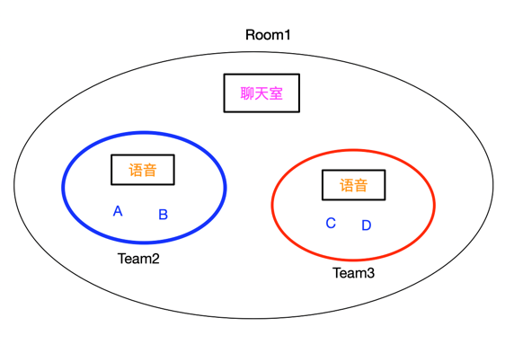

# MGS API 脑图

# MGS名词字典

|  名词   | 解释  |
|  ----  | ----  |
| Room  | 房间 |
| Team  | 队伍 |
| voice  | 语音|
| roomChat  | 聊天室|
| roomIdFromCp  | 房间或者队伍的ID(来自CP) |
| roomShowNum  | 房间或者队伍的MGS ID(用于展示和搜索) |
| roomState  | 房间或者队伍的状态|

# Room
Room是一种组织形式，拥有一定数量的成员，具有容量和状态。

# Team
Team是一种特殊形式的Room，本质还是Room，并且值得注意的是 **Room的id和Team的id是用的同一个存储体系，不可以重复**。  
但Team比room多一些属性，例如 **parentRoomIdFromCp** ，则代表了Team和父房间是有关系的。  
Team必须要有父Room，否则无意义，还不如直接使用Room。  
下图中Team2和Team3的 **parentRoomIdFromCp** 是Room1。 

Team只有在特殊场景下才可以使用，例如5V5等队伍对战的情况，
这种情况是房间有10个人，但是需要分配成2个队伍，
每个队伍5个人进行对抗。

# Room/Team的能力
Room内有两种能力，**语音** 和 **聊天室**。  
**语音** 指房间内的成员可以通过即时语音进行沟通。  
**聊天室** 指房间内的成员可以通过文字进行沟通。

# Room和Team并存下的能力分布
由于Room(或Team)都拥有语音和聊天室两种能力，在Room和Team并存的情况下，两种能力该如何分配呢？  
我们在创建Team的接口入参中，多提供了 **voiceScope** 和 **roomChatScope** 两个字段。  
我们以 **voiceScope** 阐述能力的关系

|  voiceScope   | 能力范围 |
|  ----  | ----  |
| 0  | 无 |
| 1  | 房间 |
| 2  | 队伍  |

例如下图所示，如果创建Team时，**voiceScope** 是2，则语音的能力迁移至Team

